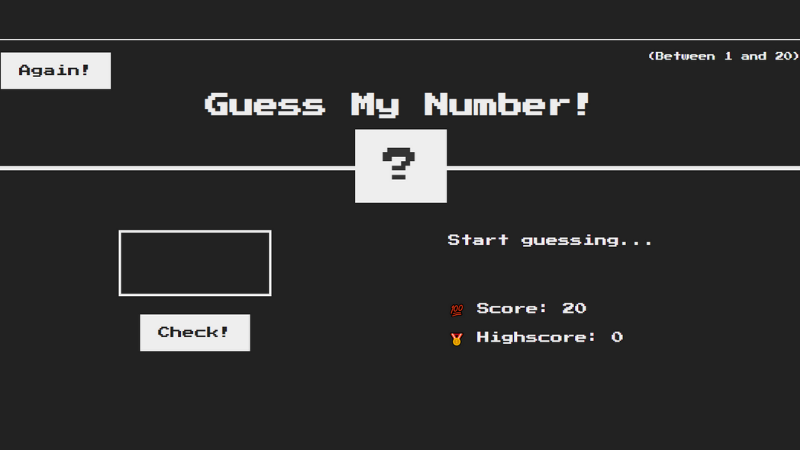
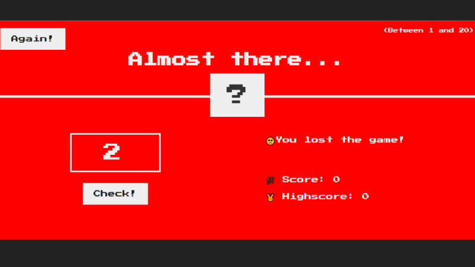
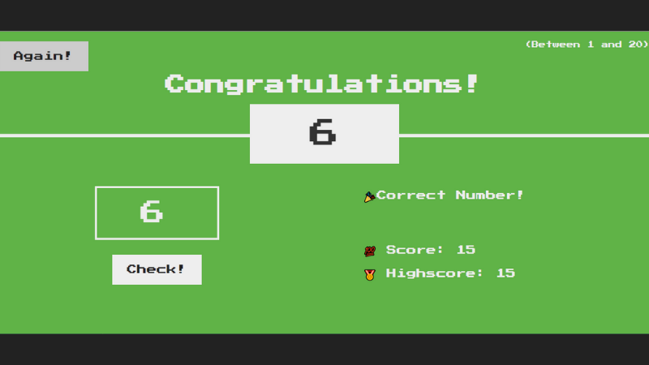
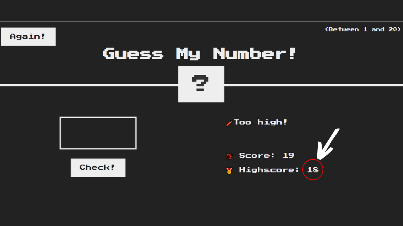

## :closed_book: Version

1.0.0

## :information_source: Available in

January 2022

## :construction_worker: Developed by

```
João Lucas Ribeiro
-> Email: ribeirojoaolucas68@gmail.com

```

> Itajubá - MG

<div align="center">
   <p><b>Let's get to the important information!</b></p>  
</div>

## 🔖 GUESS MY NUMBER® consists of 4 files and a folder, listed below:

- .prettierrc
- index.html
- script.js
- style.css
- images

## :information_source: How did Guess My Number® come about?

In order to carry out a study on DOM (Document Object Model) Manipulation **GUESS MY NUMBER®** appears, a game in which the user needs to guess the mysterious number between 0 and 20.

- Uses DOM manipulation.

- It works with changing HTML elements and CSS styling elements according to the user's mistakes and hits.

- It consists of practicing the concepts of DOM, code refactoring, handling click events and gaming logic.

> :book: As it is a study, feel free to modify and learn with the codes available here!

## 💻 How are files initially organized?

> #### 05-GUESS-MY-NUMBER
>
> > images
> >
> > > guess-my-number.png
> >
> > > lost.png
> >
> > > won.png
> >
> > .prettierrc

> > index.html

> > Readme.md

> > script.js
> > style.css

## :information_source: Important to know!

`The Operating System used was Microsoft Windows;`

> Modify the code at will!

## :information_source: To make the game work

- The `index.html` is responsible for the `game interface`.

- The `script.js` is responsible for `execution and functioning of the interface buttons`.

- Takes `a number` as input.

- The `style.js` is responsible for styling the game's interface.

## CONFIGURING PRETTIER IN VS CODE:

- Just go to the VS code extensions and search for the "Prettier" extension, and activate it.

- Serves to automatically format the text.

- Turns all single quotes into double quotes.

## INSTALLING NODE.JS AND CONFIGURING A DEV ENVIRONMENT:

- There are two ways to reload the web page automatically.

- The first is installing the Live Server extension on VS Code.

- The second is installing Node.JS (more professional option).

## DISCOVER THE VERSION OF NODE.JS YOU MAY HAVE ALREADY INSTALLED:

- Just open the terminal and type:
  `node -v`

## INSTALL LIVE SERVER ON THE TERMINAL:

- Just go to the terminal and type:
  `npm install live-server -g`

- If it's on MAC, you have to type:
  `sudo npm install live-server -g`

## TO USE THE LIVE SERVER VIA THE TERMINAL:

- Just go to the terminal and type:
  `live-server`

## EXPLANATION ABOUT THE INSTALLATION:

- `npm` is the Node Package Manager, a program for downloading tools.

- Then comes `install`, which is the command to install something.

- Then comes the name of the tool we want to install, which in this case is `live-server`.

- `-g` means the tool must be installed globally.

## :information_source: How to start the game

- Create a project in VS Code and add some files with the same names as the files in this project (you don't need the images folder or README.md).

- In each file, copy and paste the code of this project, saving the changes.

- Open a terminal and type:
  `live-server`

- A web page will open with the game's home screen.


- Once started, you just type a number from 1 to 20 in the input field and click on the `Check!` button.

- For each number chosen, Javascript, with DOM Manipulation, will validate the number and give hints if the number is above or below the secret number!

- If you miss the number 20 times, the `score` counter will reset and you will lose the game.



- If you hit the secret number, the `highscore` counter will record your number of points on the first win and you will receive a congratulations message!



- If you want to restart the game, just click the `Again!` button.

- The game will restart, but the `highscore` counter will keep the highest `score` you have ever obtained!

- Have fun finding the mysterious number until you get the highest `highscore`!


