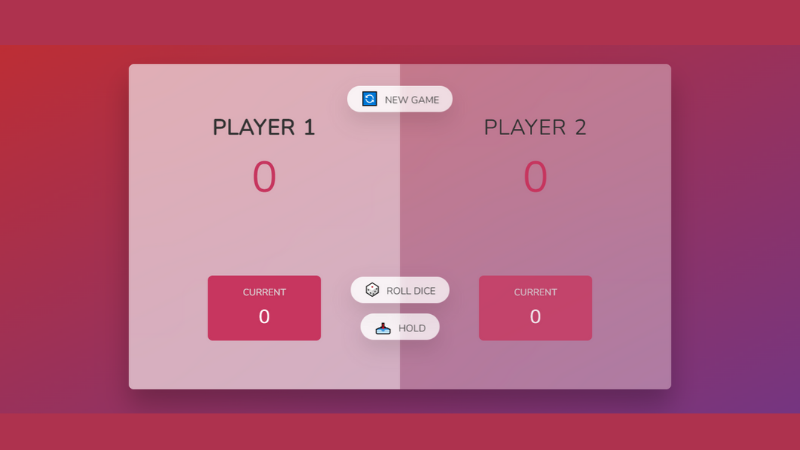
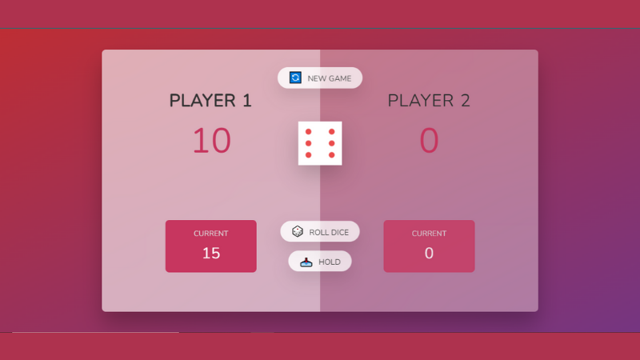
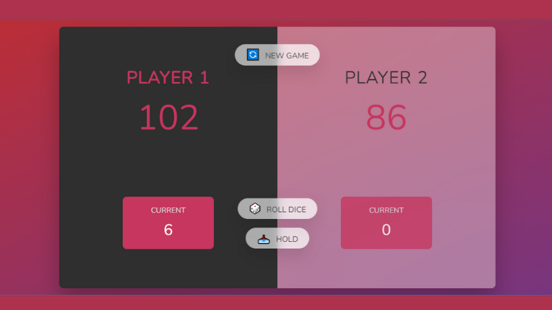

Pig game



## :closed_book: Version

1.0.0

## :information_source: Available in

January 2022

## :construction_worker: Developed by

```
João Lucas Ribeiro
-> Email: ribeirojoaolucas68@gmail.com

```

> Itajubá - MG

<div align="center">
   <p><b>Let's get to the important information!</b></p>  
</div>

## 🔖 PIG GAME® consists of 4 files and a folder, listed below:

- .prettierrc
- index.html
- script.js
- style.css
- images

## :information_source: How did Pig Game® come about?

In order to carry out a study on DOM (Document Object Model) Manipulation **PIG GAME®** appears, a game in which the user needs to roll the dice and accumulate points. Each time the die shows the number 1 face, the turn passes to the other player. At each turn, the number that appears on the face of the die is added to the player's score (except for 1). The player can pass the turn to the next player before a face with the number 1 falls, but if the number 1 falls, his score will be zero and will not be added to the total score. The player who accumulates 100 points or more, before the other player, wins!

- Uses DOM manipulation.

- It works with changing HTML elements and CSS styling elements according to the user's mistakes and hits.

- It consists of practicing the concepts of DOM, code refactoring, handling click events and gaming logic.

> :book: As it is a study, feel free to modify and learn with the codes available here!

## 💻 How are files initially organized?

> #### 07-PIG-GAME
>
> > images
> >
> > > dice-1.png
> >
> > > dice-2.png
> >
> > > dice-3.png
> >
> > > dice-4.png
> >
> > > dice-5.png
> >
> > > dice-6.png
> >
> > > pig-game-flowchart
> >
> > > pig-game.png
> >
> > .prettierrc

> > index.html

> > Readme.md

> > script.js
> > style.css

## :information_source: Important to know!

`The Operating System used was Microsoft Windows;`

> Modify the code at will!

## :information_source: To make the game work

- The `index.html` is responsible for the `game interface`.

- The `script.js` is responsible for `execution and functioning of the interface buttons`.

- The `style.js` is responsible for styling the game's interface.

## CONFIGURING PRETTIER IN VS CODE:

- Just go to the VS code extensions and search for the "Prettier" extension, and activate it.

- Serves to automatically format the text.

- Turns all single quotes into double quotes.

## INSTALLING NODE.JS AND CONFIGURING A DEV ENVIRONMENT:

- There are two ways to reload the web page automatically.

- The first is installing the Live Server extension on VS Code.

- The second is installing Node.JS (more professional option).

## DISCOVER THE VERSION OF NODE.JS YOU MAY HAVE ALREADY INSTALLED:

- Just open the terminal and type:
  `node -v`

## INSTALL LIVE SERVER ON THE TERMINAL:

- Just go to the terminal and type:
  `npm install live-server -g`

- If it's on MAC, you have to type:
  `sudo npm install live-server -g`

## TO USE THE LIVE SERVER VIA THE TERMINAL:

- Just go to the terminal and type:
  `live-server`

## EXPLANATION ABOUT THE INSTALLATION:

- `npm` is the Node Package Manager, a program for downloading tools.

- Then comes `install`, which is the command to install something.

- Then comes the name of the tool we want to install, which in this case is `live-server`.

- `-g` means the tool must be installed globally.

## :information_source: How to start the game

- Create a project in VS Code and add some files with the same names as the files in this project (you also need the images folder with those images).

- In each file or folder, copy and paste the code or images of this project, saving the changes.

- Open a terminal and type:
  `live-server`

- A web page will open with the game's home screen.


- Once started, you just click on the `ROLL DICE` button.

- For each roll of the dice, you can accumulate points or lose points if the number 1 falls.

- The flowchart below better shows how the system will react to each possible move.


- If you are worried that the next roll of the dice will show the number 1, just click on the `HOLD` button, then your turn will be passed to the other player and your score will be added to the total score.



- If you want to restart the game, just click the `NEW GAME` button.

- The game will restart, just like it was in the beginning!

- Have fun rolling the dice until you get the maximum score before your opponent!


